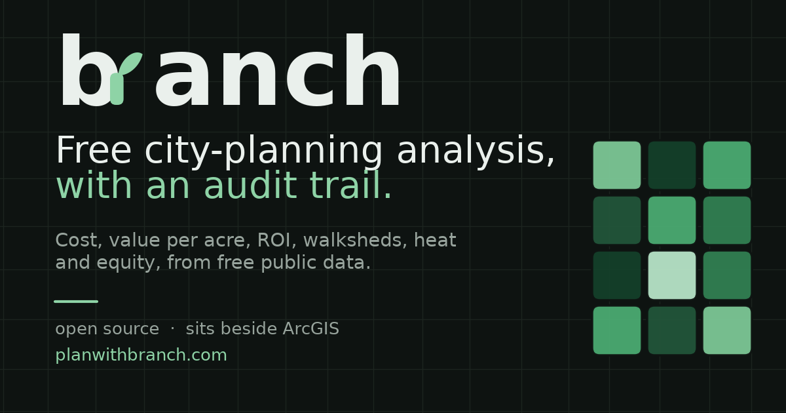

# branch



Live at [planwithbranch.com](https://planwithbranch.com).

Free, open-source city-planning analysis that runs in your browser. Ask a
planning question in plain English, or click a tool, and branch computes the
answer from free public data and draws it on the map, along with the exact
inputs it used.

branch reads the same open data a GIS already uses (OpenStreetMap and public
government sources), so it works alongside ArcGIS or QGIS instead of replacing
them.

## What it does

A MapLibre map with street, satellite, and dark basemaps, address search,
drag-and-drop of your own GeoJSON or CSV (which stays in your browser), draw
tools, a layers panel, and a set of analysis tools. Every tool is both a button
and a function the optional assistant can call.

| Category | Tools |
|---|---|
| Planning | CoolWalk shade routing, walkshed (15-minute-city isochrone), utility clearance check |
| Fiscal | cost estimate, value per acre, benefit-cost / ROI |
| Geoprocessing | buffer, spatial join, clip to an area, density hotspots |
| Data | OpenStreetMap features |

Each tool reprojects to a metric coordinate system, validates geometry, and
returns its result together with a small recipe (the tool plus the exact
parameters it ran), so any answer can be reproduced.

## Quickstart

```bash
pip install -e ".[full]"
branch serve
```

Open http://localhost:8000 and point it at any area with OpenStreetMap coverage.
Address search uses OpenStreetMap Nominatim; the fiscal tools ship with editable
US public unit-cost defaults.

## The assistant is optional

The "Ask the map" bar calls the same tools listed above. Bring your own model
key (Anthropic or OpenAI, kept only in your browser) or run a local model with
Ollama, so your data never leaves your machine. Without a key, every tool still
works as a button.

## Use it beside ArcGIS

`arcgis/branch_toolbox.pyt` is an ArcGIS Pro Python Toolbox that runs the
shade-routing pipeline and writes standard GIS files (Shapefile, GeoJSON, CSV)
onto the active map. See [`arcgis/README.md`](arcgis/README.md).

## Development

```bash
pip install -e ".[dev]"
pytest
```

The core router needs only the base dependencies; the analytics modules (ArcGIS
export, PostGIS, raster, machine learning) use the `[full]` extra. A `Dockerfile`
and `fly.toml` are included for container deploys, and `docker-compose.yml`
brings up PostGIS for the spatial-SQL layer. The Python geospatial backend needs
a container host rather than a serverless one.

## Tech

MapLibre GL JS, Flask, GeoPandas / Shapely / rasterio, osmnx / networkx,
scikit-learn, and PostGIS, over free public data (OpenStreetMap and public
government sources).

## License

MIT. Data from OpenStreetMap (ODbL) and public government sources. Not
affiliated with Esri or any city.
